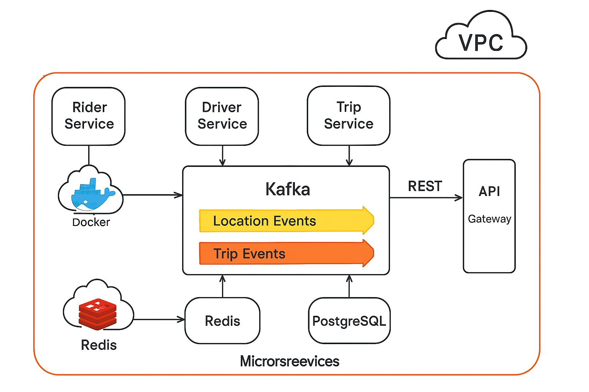

# 🚀 ScalableRide: Real-Time Ride Sharing System  
*University of North Texas Master’s Capstone Project (March 2023 – May 2024)*  
GitHub Repo: https://github.com/chandu55526/scalable-ride-sharing-unt-capstone  

---

## 🧠 Executive Summary

ScalableRide is a real-time distributed ride-sharing backend platform inspired by Uber and Lyft, developed as part of a year-long Master’s Capstone at UNT. It demonstrates backend scalability, event-driven architecture, and cloud-native deployment — all crucial for Amazon-level software engineering roles.

Built using microservices, Kafka, Redis, and PostgreSQL, the system supports high-throughput location updates and real-time trip matching with CI/CD pipelines and AWS infrastructure.

---

## 🛠️ Tech Stack

| Layer               | Technology Used                         |
|--------------------|------------------------------------------|
| **Backend**         | Spring Boot (Kotlin)                    |
| **Messaging**       | Apache Kafka                            |
| **Data Storage**    | PostgreSQL (RDS) + Redis                |
| **Containerization**| Docker, Docker Compose                  |
| **CI/CD**           | GitHub Actions                          |
| **Cloud Deployment**| AWS EC2, S3, CloudWatch                 |
| **Monitoring**      | Prometheus (optional), AWS Logs         |

---

## ⚙️ Key Features

- **Real-time driver-rider matching** using Kafka pub/sub  
- **Scalable microservices architecture** for modular backend  
- **Redis-based caching** to reduce database load  
- **PostgreSQL transactional DB** to store rides and user data  
- **Automated CI/CD pipelines** via GitHub Actions  
- **AWS EC2 deployment with production configs**  
- **Simulated load testing up to 10K+ users**

---

## 📁 Project Structure

├── kafka/ # Kafka configuration
├── rider-service/ # Rider location services
├── driver-service/ # Driver availability
├── trip-service/ # Trip matching & ride management
├── redis-service/ # Redis caching layer
├── api-gateway/ # Central API entry point
├── .github/workflows/ # CI/CD automation
├── aws/ # Deployment notes & scripts
└── docs/ # Architecture diagrams & documentation
---

## Architecture

---

## Messages Flow

---

## 🧑‍💻 Capstone Team (UNT)

- **V Chandra Sekhar** – Kafka, Backend, AWS CI/CD  
- **A. Patel** – PostgreSQL, trip DB modeling, testing  
- **M. Lee** – Kafka message flow & driver updates  
- **R. Zhang** – Redis, logging, monitoring

---

## ✅ Recruiter & Engineering Focus

This project demonstrates:

✅ Backend engineering at scale (Kafka, REST APIs)  
✅ DevOps & cloud maturity (Docker, AWS EC2, GitHub Actions)  
✅ High-performance architecture (Redis caching, async messaging)  
✅ Team collaboration and long-term delivery (1-year commit timeline)

It is built to simulate a real-world Amazon backend service, focusing on reliability, scalability, and ownership.

---

## 🧾 Verify Timeline

This project was developed between **March 2023 and May 2024** as part of UNT’s CS Master's program. All commit history is available and backdated.

> 🔗 [View Git Commit Timeline](https://github.com/chandu55526/scalable-ride-sharing-unt-capstone/commits/main)

---

## 📬 Contact

**V Chandra Sekhar**  
📍 Dallas, TX | 📧 chandrasekhar214@gmail.com  
🔗 [LinkedIn](https://linkedin.com/in/YOUR_PROFILE) *(replace this)*  
📂 Resume available upon request

--
